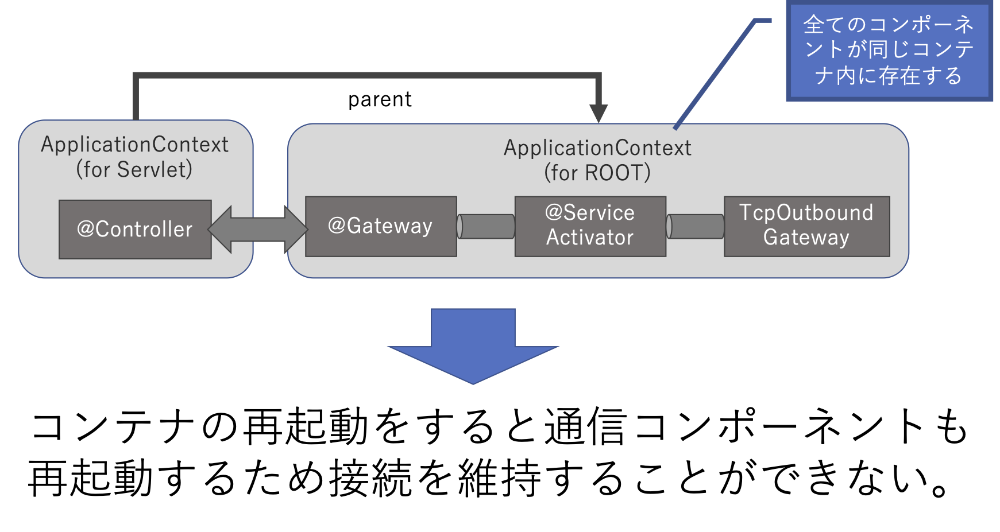
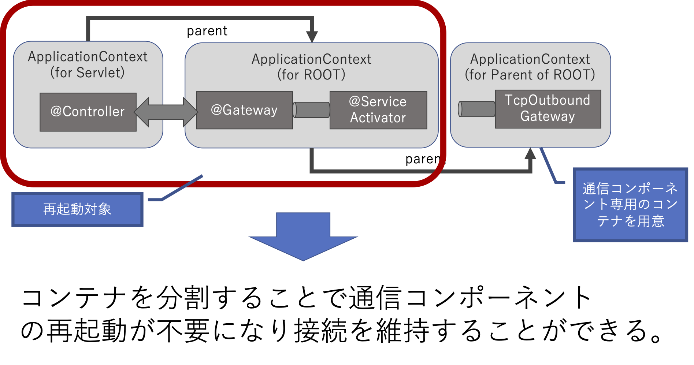
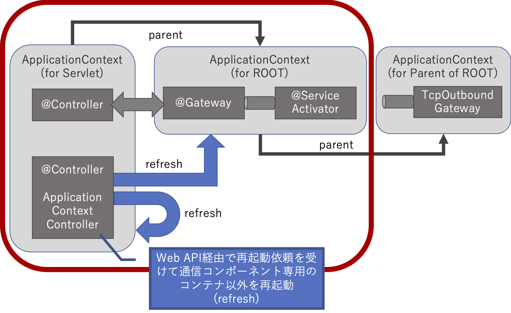
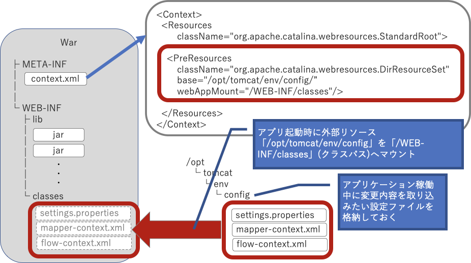

# spring-webapp-restart

Example for restarting DI container on spring web application(war)

# Motivation

アプリケーション自体の再起動はすぜにコンポーネントの再作成したい。ただし特定のコンポーネント（例：外部システムとの通信コンポーネント）は接続を維持したいので再作成したくない。 ※大前提として・・・Spring Cloudの `@RefreshScope` は使わないものとする（＝Spring Clouldは利用しない）

現状のDIコンテナの構成、および問題点は以下のとおり。



# Solution

再作成が必要なものとそうでないものを別のコンテナ(アプリケーションコンテキスト)で管理さればいけそう。



コンポーネントの再作成は管理用のWeb APIを用意して、必要なタイミングで外部からキックしてもらう。



# How to manage resource as external resource

再作成対象のコンポーネントを生成するためのbean定義ファイルやプロパティファイルは、Warファイルの中ではなくAPサーバ内の外部ディレクトリの中に配置する。



# Integration Test for Sample

## Precondition

* テストを実行するユーザに「`/opt/tomcat/env/config/settings.properties`」の書き込み権限があること ※ディレクトリへ書き込み権限があればテスト実行時に `settings.properties` は作成される

## 実行

```
 % ./mvnw verify
[INFO] Scanning for projects...
[INFO] 
[INFO] -----------------< org.example:spring-webapp-restart >------------------
[INFO] Building spring-webapp-restart 1.0-SNAPSHOT
[INFO] --------------------------------[ war ]---------------------------------
[INFO] 
[INFO] --- maven-resources-plugin:2.6:resources (default-resources) @ spring-webapp-restart ---
[INFO] Using 'UTF-8' encoding to copy filtered resources.
[INFO] Copying 4 resources
[INFO] 
[INFO] --- maven-compiler-plugin:3.1:compile (default-compile) @ spring-webapp-restart ---
[INFO] Nothing to compile - all classes are up to date
[INFO] 
[INFO] --- maven-resources-plugin:2.6:testResources (default-testResources) @ spring-webapp-restart ---
[INFO] Using 'UTF-8' encoding to copy filtered resources.
[INFO] Copying 0 resource
[INFO] 
[INFO] --- maven-compiler-plugin:3.1:testCompile (default-testCompile) @ spring-webapp-restart ---
[INFO] Nothing to compile - all classes are up to date
[INFO] 
[INFO] --- maven-surefire-plugin:2.12.4:test (default-test) @ spring-webapp-restart ---
[INFO] 
[INFO] --- maven-war-plugin:3.2.3:war (default-war) @ spring-webapp-restart ---
[INFO] Packaging webapp
[INFO] Assembling webapp [spring-webapp-restart] in [/Users/shimizukazuki/git-tmp/spring-webapp-restart/target/spring-webapp-restart]
[INFO] Processing war project
[INFO] Copying webapp resources [/Users/shimizukazuki/git-tmp/spring-webapp-restart/src/main/webapp]
[INFO] Webapp assembled in [99 msecs]
[INFO] Building war: /Users/shimizukazuki/git-tmp/spring-webapp-restart/target/spring-webapp-restart.war
[INFO] 
[INFO] --- cargo-maven2-plugin:1.7.11:start (start-container) @ spring-webapp-restart ---
[INFO] [2.ContainerStartMojo] Resolved container artifact org.codehaus.cargo:cargo-core-container-tomcat:jar:1.7.11 for container tomcat9x
[INFO] [talledLocalContainer] Tomcat 9.x starting...
[INFO] [stalledLocalDeployer] Deploying [/Users/shimizukazuki/git-tmp/spring-webapp-restart/target/spring-webapp-restart.war] to [/Users/shimizukazuki/git-tmp/spring-webapp-restart/target/cargo/configurations/tomcat9x/webapps]...
[INFO] [talledLocalContainer] 3月 24, 2020 1:55:47 午前 org.apache.catalina.startup.VersionLoggerListener log
[INFO] [talledLocalContainer] 情報: Serverのバージョン名：Apache Tomcat/9.0.33
[INFO] [talledLocalContainer] 3月 24, 2020 1:55:47 午前 org.apache.catalina.startup.VersionLoggerListener log
[INFO] [talledLocalContainer] 情報: Server ビルド:          Mar 11 2020 09:31:38 UTC
[INFO] [talledLocalContainer] 3月 24, 2020 1:55:47 午前 org.apache.catalina.startup.VersionLoggerListener log
[INFO] [talledLocalContainer] 情報: サーバーのバージョン番号：9.0.33.0
[INFO] [talledLocalContainer] 3月 24, 2020 1:55:47 午前 org.apache.catalina.startup.VersionLoggerListener log
[INFO] [talledLocalContainer] 情報: OS 名:               Mac OS X
[INFO] [talledLocalContainer] 3月 24, 2020 1:55:47 午前 org.apache.catalina.startup.VersionLoggerListener log
[INFO] [talledLocalContainer] 情報: OS バージョン:            10.15.3
[INFO] [talledLocalContainer] 3月 24, 2020 1:55:47 午前 org.apache.catalina.startup.VersionLoggerListener log
[INFO] [talledLocalContainer] 情報: アーキテクチャ:          x86_64
[INFO] [talledLocalContainer] 3月 24, 2020 1:55:47 午前 org.apache.catalina.startup.VersionLoggerListener log
[INFO] [talledLocalContainer] 情報: Java Home:             /Library/Java/JavaVirtualMachines/jdk-11.0.1.jdk/Contents/Home
[INFO] [talledLocalContainer] 3月 24, 2020 1:55:47 午前 org.apache.catalina.startup.VersionLoggerListener log
[INFO] [talledLocalContainer] 情報: JVM バージョン:           11.0.1+13
[INFO] [talledLocalContainer] 3月 24, 2020 1:55:47 午前 org.apache.catalina.startup.VersionLoggerListener log
[INFO] [talledLocalContainer] 情報: JVM ベンダ：            Oracle Corporation
[INFO] [talledLocalContainer] 3月 24, 2020 1:55:47 午前 org.apache.catalina.startup.VersionLoggerListener log
[INFO] [talledLocalContainer] 情報: CATALINA_BASE:         /Users/shimizukazuki/git-tmp/spring-webapp-restart/target/cargo/configurations/tomcat9x
[INFO] [talledLocalContainer] 3月 24, 2020 1:55:47 午前 org.apache.catalina.startup.VersionLoggerListener log
[INFO] [talledLocalContainer] 情報: CATALINA_HOME:         /Users/shimizukazuki/git-tmp/spring-webapp-restart/target/cargo/installs/apache-tomcat-9.0.33/apache-tomcat-9.0.33
[INFO] [talledLocalContainer] 3月 24, 2020 1:55:47 午前 org.apache.catalina.startup.VersionLoggerListener log
[INFO] [talledLocalContainer] 情報: コマンドライン引数：-Xms128m
[INFO] [talledLocalContainer] 3月 24, 2020 1:55:47 午前 org.apache.catalina.startup.VersionLoggerListener log
[INFO] [talledLocalContainer] 情報: コマンドライン引数：-Xmx512m
[INFO] [talledLocalContainer] 3月 24, 2020 1:55:47 午前 org.apache.catalina.startup.VersionLoggerListener log
[INFO] [talledLocalContainer] 情報: コマンドライン引数：-Dcatalina.home=/Users/shimizukazuki/git-tmp/spring-webapp-restart/target/cargo/installs/apache-tomcat-9.0.33/apache-tomcat-9.0.33
[INFO] [talledLocalContainer] 3月 24, 2020 1:55:47 午前 org.apache.catalina.startup.VersionLoggerListener log
[INFO] [talledLocalContainer] 情報: コマンドライン引数：-Dcatalina.base=/Users/shimizukazuki/git-tmp/spring-webapp-restart/target/cargo/configurations/tomcat9x
[INFO] [talledLocalContainer] 3月 24, 2020 1:55:47 午前 org.apache.catalina.startup.VersionLoggerListener log
[INFO] [talledLocalContainer] 情報: コマンドライン引数：-Djava.io.tmpdir=/Users/shimizukazuki/git-tmp/spring-webapp-restart/target/cargo/configurations/tomcat9x/temp
[INFO] [talledLocalContainer] 3月 24, 2020 1:55:47 午前 org.apache.catalina.startup.VersionLoggerListener log
[INFO] [talledLocalContainer] 情報: コマンドライン引数：-Djava.util.logging.manager=org.apache.juli.ClassLoaderLogManager
[INFO] [talledLocalContainer] 3月 24, 2020 1:55:47 午前 org.apache.catalina.startup.VersionLoggerListener log
[INFO] [talledLocalContainer] 情報: コマンドライン引数：-Djava.util.logging.config.file=/Users/shimizukazuki/git-tmp/spring-webapp-restart/target/cargo/configurations/tomcat9x/conf/logging.properties
[INFO] [talledLocalContainer] 3月 24, 2020 1:55:47 午前 org.apache.catalina.core.AprLifecycleListener lifecycleEvent
[INFO] [talledLocalContainer] 情報: 商用環境に最適な性能を発揮する APR ベースの Tomcat ネイティブライブラリが java.library.path [/Users/shimizukazuki/Library/Java/Extensions:/Library/Java/Extensions:/Network/Library/Java/Extensions:/System/Library/Java/Extensions:/usr/lib/java:.] に存在しません。
[INFO] [talledLocalContainer] 3月 24, 2020 1:55:48 午前 org.apache.coyote.AbstractProtocol init
[INFO] [talledLocalContainer] 情報: プロトコルハンドラ ["http-nio-8080"] を初期化します。
[INFO] [talledLocalContainer] 3月 24, 2020 1:55:48 午前 org.apache.catalina.startup.Catalina load
[INFO] [talledLocalContainer] 情報: サーバーの初期化 [465]ms
[INFO] [talledLocalContainer] 3月 24, 2020 1:55:48 午前 org.apache.catalina.core.StandardService startInternal
[INFO] [talledLocalContainer] 情報: サービス [Catalina] を起動します
[INFO] [talledLocalContainer] 3月 24, 2020 1:55:48 午前 org.apache.catalina.core.StandardEngine startInternal
[INFO] [talledLocalContainer] 情報: サーブレットエンジンの起動：[Apache Tomcat/9.0.33]
[INFO] [talledLocalContainer] 3月 24, 2020 1:55:48 午前 org.apache.catalina.startup.HostConfig deployWAR
[INFO] [talledLocalContainer] 情報: Webアプリケーションアーカイブ [/Users/shimizukazuki/git-tmp/spring-webapp-restart/target/cargo/configurations/tomcat9x/webapps/cargocpc.war] を配備します
[INFO] [talledLocalContainer] 3月 24, 2020 1:55:48 午前 org.apache.catalina.startup.HostConfig deployWAR
[INFO] [talledLocalContainer] 情報: Web アプリケーションアーカイブ [/Users/shimizukazuki/git-tmp/spring-webapp-restart/target/cargo/configurations/tomcat9x/webapps/cargocpc.war] の配置は [199] ms で完了しました。
[INFO] [talledLocalContainer] 3月 24, 2020 1:55:48 午前 org.apache.catalina.startup.HostConfig deployWAR
[INFO] [talledLocalContainer] 情報: Webアプリケーションアーカイブ [/Users/shimizukazuki/git-tmp/spring-webapp-restart/target/cargo/configurations/tomcat9x/webapps/spring-webapp-restart.war] を配備します
[INFO] [talledLocalContainer] 3月 24, 2020 1:55:50 午前 org.apache.jasper.servlet.TldScanner scanJars
[INFO] [talledLocalContainer] 情報: 少なくとも1つのJARが、まだTLDを含んでいないTLDについてスキャンされました。 スキャンしたが、そこにTLDが見つからなかったJARの完全なリストについては、このロガーのデバッグログを有効にしてください。 スキャン中に不要なJARをスキップすると、起動時間とJSPのコンパイル時間が改善されます。
[INFO] [talledLocalContainer] 3月 24, 2020 1:55:50 午前 org.apache.catalina.core.ApplicationContext log
[INFO] [talledLocalContainer] 情報: No Spring WebApplicationInitializer types detected on classpath
[INFO] [talledLocalContainer] 3月 24, 2020 1:55:50 午前 org.apache.catalina.core.ApplicationContext log
[INFO] [talledLocalContainer] 情報: Initializing Spring root WebApplicationContext
[INFO] [talledLocalContainer] 3月 24, 2020 1:55:50 午前 org.springframework.web.context.ContextLoader initWebApplicationContext
[INFO] [talledLocalContainer] 情報: Root WebApplicationContext: initialization started
[INFO] [talledLocalContainer] 3月 24, 2020 1:55:50 午前 org.springframework.integration.config.xml.ChainParser parseHandler
[INFO] [talledLocalContainer] 情報: It is useful to provide an explicit 'id' attribute on 'chain' elements to simplify the identification of child elements in logs etc.
[INFO] [talledLocalContainer] 3月 24, 2020 1:55:50 午前 org.springframework.integration.config.DefaultConfiguringBeanFactoryPostProcessor registerErrorChannel
[INFO] [talledLocalContainer] 情報: No bean named 'errorChannel' has been explicitly defined. Therefore, a default PublishSubscribeChannel will be created.
[INFO] [talledLocalContainer] 3月 24, 2020 1:55:50 午前 org.springframework.integration.config.DefaultConfiguringBeanFactoryPostProcessor registerTaskScheduler
[INFO] [talledLocalContainer] 情報: No bean named 'taskScheduler' has been explicitly defined. Therefore, a default ThreadPoolTaskScheduler will be created.
[INFO] [talledLocalContainer] 3月 24, 2020 1:55:50 午前 org.springframework.integration.config.DefaultConfiguringBeanFactoryPostProcessor registerHeaderChannelRegistry
[INFO] [talledLocalContainer] 情報: No bean named 'integrationHeaderChannelRegistry' has been explicitly defined. Therefore, a default DefaultHeaderChannelRegistry will be created.
[INFO] [talledLocalContainer] 3月 24, 2020 1:55:51 午前 org.springframework.scheduling.concurrent.ExecutorConfigurationSupport initialize
[INFO] [talledLocalContainer] 情報: Initializing ExecutorService 'taskScheduler'
[INFO] [talledLocalContainer] 3月 24, 2020 1:55:51 午前 org.springframework.integration.handler.MessageHandlerChain start
[INFO] [talledLocalContainer] 情報: started bean 'org.springframework.integration.handler.MessageHandlerChain#0'; defined in: 'URL [file:/Users/shimizukazuki/git-tmp/spring-webapp-restart/target/cargo/configurations/tomcat9x/webapps/spring-webapp-restart/WEB-INF/classes/META-INF/spring/tcpConnectorContext.xml]'; from source: ''int:chain''
[INFO] [talledLocalContainer] 3月 24, 2020 1:55:51 午前 org.springframework.integration.endpoint.EventDrivenConsumer logComponentSubscriptionEvent
[INFO] [talledLocalContainer] 情報: Adding {chain} as a subscriber to the 'outboundConnectorChannel' channel
[INFO] [talledLocalContainer] 3月 24, 2020 1:55:51 午前 org.springframework.integration.channel.AbstractSubscribableChannel adjustCounterIfNecessary
[INFO] [talledLocalContainer] 情報: Channel 'org.springframework.web.context.support.XmlWebApplicationContext@13d5606c.outboundConnectorChannel' has 1 subscriber(s).
[INFO] [talledLocalContainer] 3月 24, 2020 1:55:51 午前 org.springframework.integration.endpoint.AbstractEndpoint start
[INFO] [talledLocalContainer] 情報: started bean 'org.springframework.integration.config.ConsumerEndpointFactoryBean#0'
[INFO] [talledLocalContainer] 3月 24, 2020 1:55:51 午前 org.springframework.integration.ip.tcp.connection.AbstractConnectionFactory start
[INFO] [talledLocalContainer] 情報: started bean 'clientConnectionFactory', host=localhost, port=9999
[INFO] [talledLocalContainer] 3月 24, 2020 1:55:51 午前 org.springframework.integration.endpoint.EventDrivenConsumer logComponentSubscriptionEvent
[INFO] [talledLocalContainer] 情報: Adding {ip:tcp-outbound-gateway} as a subscriber to the 'tcpOutboundGatewayChannel' channel
[INFO] [talledLocalContainer] 3月 24, 2020 1:55:51 午前 org.springframework.integration.channel.AbstractSubscribableChannel adjustCounterIfNecessary
[INFO] [talledLocalContainer] 情報: Channel 'org.springframework.web.context.support.XmlWebApplicationContext@13d5606c.tcpOutboundGatewayChannel' has 1 subscriber(s).
[INFO] [talledLocalContainer] 3月 24, 2020 1:55:51 午前 org.springframework.integration.ip.tcp.connection.AbstractConnectionFactory start
[INFO] [talledLocalContainer] 情報: started bean 'clientConnectionFactory', host=localhost, port=9999
[INFO] [talledLocalContainer] 3月 24, 2020 1:55:51 午前 org.springframework.integration.endpoint.AbstractEndpoint start
[INFO] [talledLocalContainer] 情報: started bean 'org.springframework.integration.config.ConsumerEndpointFactoryBean#1'
[INFO] [talledLocalContainer] 3月 24, 2020 1:55:51 午前 org.springframework.integration.endpoint.EventDrivenConsumer logComponentSubscriptionEvent
[INFO] [talledLocalContainer] 情報: Adding {logging-channel-adapter:_org.springframework.integration.errorLogger} as a subscriber to the 'errorChannel' channel
[INFO] [talledLocalContainer] 3月 24, 2020 1:55:51 午前 org.springframework.integration.channel.AbstractSubscribableChannel adjustCounterIfNecessary
[INFO] [talledLocalContainer] 情報: Channel 'org.springframework.web.context.support.XmlWebApplicationContext@13d5606c.errorChannel' has 1 subscriber(s).
[INFO] [talledLocalContainer] 3月 24, 2020 1:55:51 午前 org.springframework.integration.endpoint.AbstractEndpoint start
[INFO] [talledLocalContainer] 情報: started bean '_org.springframework.integration.errorLogger'
[INFO] [talledLocalContainer] class com.example.app.InboundComponent.afterPropertiesSet d6cf2fb2-9a30-43d2-9fd7-c8d5a6fc661d
[INFO] [talledLocalContainer] class com.example.app.RelayComponent.afterPropertiesSet 981e5758-36c8-4f8e-acc1-32e9023e3e92
[INFO] [talledLocalContainer] class com.example.app.OutboundComponent.afterPropertiesSet 50cc36fb-6c94-41b4-be30-c43b1041632d
[INFO] [talledLocalContainer] 3月 24, 2020 1:55:51 午前 org.springframework.integration.endpoint.EventDrivenConsumer logComponentSubscriptionEvent
[INFO] [talledLocalContainer] 情報: Adding {service-activator} as a subscriber to the 'inboundFlowChannel' channel
[INFO] [talledLocalContainer] 3月 24, 2020 1:55:51 午前 org.springframework.integration.channel.AbstractSubscribableChannel adjustCounterIfNecessary
[INFO] [talledLocalContainer] 情報: Channel 'org.springframework.web.context.WebApplicationContext:/spring-webapp-restart.inboundFlowChannel' has 1 subscriber(s).
[INFO] [talledLocalContainer] 3月 24, 2020 1:55:51 午前 org.springframework.integration.endpoint.AbstractEndpoint start
[INFO] [talledLocalContainer] 情報: started bean 'org.springframework.integration.config.ConsumerEndpointFactoryBean#0'
[INFO] [talledLocalContainer] 3月 24, 2020 1:55:51 午前 org.springframework.integration.endpoint.EventDrivenConsumer logComponentSubscriptionEvent
[INFO] [talledLocalContainer] 情報: Adding {service-activator} as a subscriber to the 'relayFlowChannel' channel
[INFO] [talledLocalContainer] 3月 24, 2020 1:55:51 午前 org.springframework.integration.channel.AbstractSubscribableChannel adjustCounterIfNecessary
[INFO] [talledLocalContainer] 情報: Channel 'org.springframework.web.context.WebApplicationContext:/spring-webapp-restart.relayFlowChannel' has 1 subscriber(s).
[INFO] [talledLocalContainer] 3月 24, 2020 1:55:51 午前 org.springframework.integration.endpoint.AbstractEndpoint start
[INFO] [talledLocalContainer] 情報: started bean 'org.springframework.integration.config.ConsumerEndpointFactoryBean#1'
[INFO] [talledLocalContainer] 3月 24, 2020 1:55:51 午前 org.springframework.integration.endpoint.EventDrivenConsumer logComponentSubscriptionEvent
[INFO] [talledLocalContainer] 情報: Adding {service-activator} as a subscriber to the 'outboundFlowChannel' channel
[INFO] [talledLocalContainer] 3月 24, 2020 1:55:51 午前 org.springframework.integration.channel.AbstractSubscribableChannel adjustCounterIfNecessary
[INFO] [talledLocalContainer] 情報: Channel 'org.springframework.web.context.WebApplicationContext:/spring-webapp-restart.outboundFlowChannel' has 1 subscriber(s).
[INFO] [talledLocalContainer] 3月 24, 2020 1:55:51 午前 org.springframework.integration.endpoint.AbstractEndpoint start
[INFO] [talledLocalContainer] 情報: started bean 'org.springframework.integration.config.ConsumerEndpointFactoryBean#2'
[INFO] [talledLocalContainer] 3月 24, 2020 1:55:51 午前 org.springframework.integration.endpoint.AbstractEndpoint start
[INFO] [talledLocalContainer] 情報: started bean 'inboundGateway'
[INFO] [talledLocalContainer] 3月 24, 2020 1:55:51 午前 org.springframework.integration.endpoint.AbstractEndpoint start
[INFO] [talledLocalContainer] 情報: started bean 'inboundGateway'
[INFO] [talledLocalContainer] 3月 24, 2020 1:55:51 午前 org.springframework.web.context.ContextLoader initWebApplicationContext
[INFO] [talledLocalContainer] 情報: Root WebApplicationContext initialized in 1533 ms
[INFO] [talledLocalContainer] 3月 24, 2020 1:55:51 午前 org.apache.catalina.core.ApplicationContext log
[INFO] [talledLocalContainer] 情報: Initializing Spring DispatcherServlet 'appServlet'
[INFO] [talledLocalContainer] 3月 24, 2020 1:55:51 午前 org.springframework.web.servlet.FrameworkServlet initServletBean
[INFO] [talledLocalContainer] 情報: Initializing Servlet 'appServlet'
[INFO] [talledLocalContainer] class com.example.app.InboundController:afterPropertiesSet
[INFO] [talledLocalContainer] 3月 24, 2020 1:55:52 午前 org.springframework.web.servlet.FrameworkServlet initServletBean
[INFO] [talledLocalContainer] 情報: Completed initialization in 671 ms
[INFO] [talledLocalContainer] 3月 24, 2020 1:55:52 午前 org.apache.catalina.startup.HostConfig deployWAR
[INFO] [talledLocalContainer] 情報: Web アプリケーションアーカイブ [/Users/shimizukazuki/git-tmp/spring-webapp-restart/target/cargo/configurations/tomcat9x/webapps/spring-webapp-restart.war] の配置は [3,943] ms で完了しました。
[INFO] [talledLocalContainer] 3月 24, 2020 1:55:52 午前 org.apache.catalina.startup.HostConfig deployDirectory
[INFO] [talledLocalContainer] 情報: Webアプリケーションディレクトリ [/Users/shimizukazuki/git-tmp/spring-webapp-restart/target/cargo/configurations/tomcat9x/webapps/manager] を配備します
[INFO] [talledLocalContainer] 3月 24, 2020 1:55:52 午前 org.apache.catalina.startup.HostConfig deployDirectory
[INFO] [talledLocalContainer] 情報: ディレクトリ [/Users/shimizukazuki/git-tmp/spring-webapp-restart/target/cargo/configurations/tomcat9x/webapps/manager] の Web アプリケーションの配置は [29] ms で完了しました。
[INFO] [talledLocalContainer] 3月 24, 2020 1:55:52 午前 org.apache.catalina.startup.HostConfig deployDirectory
[INFO] [talledLocalContainer] 情報: Webアプリケーションディレクトリ [/Users/shimizukazuki/git-tmp/spring-webapp-restart/target/cargo/configurations/tomcat9x/webapps/host-manager] を配備します
[INFO] [talledLocalContainer] 3月 24, 2020 1:55:52 午前 org.apache.catalina.startup.HostConfig deployDirectory
[INFO] [talledLocalContainer] 情報: ディレクトリ [/Users/shimizukazuki/git-tmp/spring-webapp-restart/target/cargo/configurations/tomcat9x/webapps/host-manager] の Web アプリケーションの配置は [16] ms で完了しました。
[INFO] [talledLocalContainer] 3月 24, 2020 1:55:52 午前 org.apache.coyote.AbstractProtocol start
[INFO] [talledLocalContainer] 情報: プロトコルハンドラー ["http-nio-8080"] を開始しました。
[INFO] [talledLocalContainer] 3月 24, 2020 1:55:52 午前 org.apache.catalina.startup.Catalina start
[INFO] [talledLocalContainer] 情報: サーバーの起動 [4,283]ms
[INFO] [talledLocalContainer] Tomcat 9.x started on port [8080]
[INFO] 
[INFO] --- maven-failsafe-plugin:3.0.0-M4:integration-test (default) @ spring-webapp-restart ---
[INFO] 
[INFO] -------------------------------------------------------
[INFO]  T E S T S
[INFO] -------------------------------------------------------
[INFO] Running com.example.SpringWebAppRestartIT
3月 24, 2020 1:55:53 午前 org.springframework.integration.config.xml.ChainParser parseHandler
情報: It is useful to provide an explicit 'id' attribute on 'chain' elements to simplify the identification of child elements in logs etc.
3月 24, 2020 1:55:53 午前 org.springframework.integration.config.DefaultConfiguringBeanFactoryPostProcessor registerErrorChannel
情報: No bean named 'errorChannel' has been explicitly defined. Therefore, a default PublishSubscribeChannel will be created.
3月 24, 2020 1:55:53 午前 org.springframework.integration.config.DefaultConfiguringBeanFactoryPostProcessor registerTaskScheduler
情報: No bean named 'taskScheduler' has been explicitly defined. Therefore, a default ThreadPoolTaskScheduler will be created.
3月 24, 2020 1:55:53 午前 org.springframework.integration.config.DefaultConfiguringBeanFactoryPostProcessor registerHeaderChannelRegistry
情報: No bean named 'integrationHeaderChannelRegistry' has been explicitly defined. Therefore, a default DefaultHeaderChannelRegistry will be created.
3月 24, 2020 1:55:53 午前 org.springframework.scheduling.concurrent.ExecutorConfigurationSupport initialize
情報: Initializing ExecutorService 'taskScheduler'
3月 24, 2020 1:55:53 午前 org.springframework.integration.handler.MessageHandlerChain start
情報: started bean 'org.springframework.integration.handler.MessageHandlerChain#0'; defined in: 'class path resource [META-INF/spring/mockTcpServerContext.xml]'; from source: ''int:chain''
3月 24, 2020 1:55:53 午前 org.springframework.integration.endpoint.EventDrivenConsumer logComponentSubscriptionEvent
情報: Adding {chain} as a subscriber to the 'tcpServerChannel' channel
3月 24, 2020 1:55:53 午前 org.springframework.integration.channel.AbstractSubscribableChannel adjustCounterIfNecessary
情報: Channel 'org.springframework.context.support.ClassPathXmlApplicationContext@3c2ea72.tcpServerChannel' has 1 subscriber(s).
3月 24, 2020 1:55:53 午前 org.springframework.integration.endpoint.AbstractEndpoint start
情報: started bean 'org.springframework.integration.config.ConsumerEndpointFactoryBean#0'
3月 24, 2020 1:55:53 午前 org.springframework.integration.endpoint.EventDrivenConsumer logComponentSubscriptionEvent
情報: Adding {logging-channel-adapter:_org.springframework.integration.errorLogger} as a subscriber to the 'errorChannel' channel
3月 24, 2020 1:55:53 午前 org.springframework.integration.channel.AbstractSubscribableChannel adjustCounterIfNecessary
情報: Channel 'org.springframework.context.support.ClassPathXmlApplicationContext@3c2ea72.errorChannel' has 1 subscriber(s).
3月 24, 2020 1:55:53 午前 org.springframework.integration.endpoint.AbstractEndpoint start
情報: started bean '_org.springframework.integration.errorLogger'
3月 24, 2020 1:55:53 午前 org.springframework.integration.ip.tcp.connection.AbstractConnectionFactory start
情報: started bean 'serverConnectionFactory', port=9999
3月 24, 2020 1:55:53 午前 org.springframework.integration.ip.tcp.connection.AbstractConnectionFactory start
情報: started bean 'serverConnectionFactory', port=9999
3月 24, 2020 1:55:53 午前 org.springframework.integration.endpoint.AbstractEndpoint start
情報: started bean 'org.springframework.integration.ip.tcp.TcpInboundGateway#0'; defined in: 'class path resource [META-INF/spring/mockTcpServerContext.xml]'; from source: ''int-ip:tcp-inbound-gateway''
> 3月 24, 2020 1:55:53 午前 org.springframework.integration.ip.tcp.connection.TcpNetServerConnectionFactory run
情報: bean 'serverConnectionFactory', port=9999 Listening
[INFO] [talledLocalContainer] 3月 24, 2020 1:55:55 午前 org.springframework.integration.handler.support.MessagingMethodInvokerHelper initialize
[INFO] [talledLocalContainer] 情報: Overriding default instance of MessageHandlerMethodFactory with provided one.
[INFO] [talledLocalContainer] 3月 24, 2020 1:55:55 午前 org.springframework.integration.handler.support.MessagingMethodInvokerHelper initialize
[INFO] [talledLocalContainer] 情報: Overriding default instance of MessageHandlerMethodFactory with provided one.
[INFO] [talledLocalContainer] 3月 24, 2020 1:55:55 午前 org.springframework.integration.handler.support.MessagingMethodInvokerHelper initialize
[INFO] [talledLocalContainer] 情報: Overriding default instance of MessageHandlerMethodFactory with provided one.
test1 -> d6cf2fb2-9a30-43d2-9fd7-c8d5a6fc661d -> 981e5758-36c8-4f8e-acc1-32e9023e3e92(maxSize=4746) -> 50cc36fb-6c94-41b4-be30-c43b1041632d -> TCP(59177)
test2 -> d6cf2fb2-9a30-43d2-9fd7-c8d5a6fc661d -> 981e5758-36c8-4f8e-acc1-32e9023e3e92(maxSize=4746) -> 50cc36fb-6c94-41b4-be30-c43b1041632d -> TCP(59177)
[INFO] [talledLocalContainer] Restarting root context...
[INFO] [talledLocalContainer] class com.example.app.OutboundComponent.destroy 50cc36fb-6c94-41b4-be30-c43b1041632d
[INFO] [talledLocalContainer] class com.example.app.RelayComponent.destroy 981e5758-36c8-4f8e-acc1-32e9023e3e92
[INFO] [talledLocalContainer] class com.example.app.InboundComponent.destroy d6cf2fb2-9a30-43d2-9fd7-c8d5a6fc661d
[INFO] [talledLocalContainer] class com.example.app.InboundComponent.afterPropertiesSet 88fb9a14-c0b2-4ec2-ba8a-f5978a98f115
[INFO] [talledLocalContainer] class com.example.app.RelayComponent.afterPropertiesSet c38ebcfc-1b32-4658-b508-da97995d13ee
[INFO] [talledLocalContainer] class com.example.app.OutboundComponent.afterPropertiesSet 932cd81f-dca5-4850-83c3-2602289b6c4f
[INFO] [talledLocalContainer] 3月 24, 2020 1:55:55 午前 org.springframework.integration.endpoint.EventDrivenConsumer logComponentSubscriptionEvent
[INFO] [talledLocalContainer] 情報: Adding {service-activator} as a subscriber to the 'inboundFlowChannel' channel
[INFO] [talledLocalContainer] 3月 24, 2020 1:55:55 午前 org.springframework.integration.channel.AbstractSubscribableChannel adjustCounterIfNecessary
[INFO] [talledLocalContainer] 情報: Channel 'org.springframework.web.context.WebApplicationContext:/spring-webapp-restart.inboundFlowChannel' has 1 subscriber(s).
[INFO] [talledLocalContainer] 3月 24, 2020 1:55:55 午前 org.springframework.integration.endpoint.AbstractEndpoint start
[INFO] [talledLocalContainer] 情報: started bean 'org.springframework.integration.config.ConsumerEndpointFactoryBean#0'
[INFO] [talledLocalContainer] 3月 24, 2020 1:55:55 午前 org.springframework.integration.endpoint.EventDrivenConsumer logComponentSubscriptionEvent
[INFO] [talledLocalContainer] 情報: Adding {service-activator} as a subscriber to the 'relayFlowChannel' channel
[INFO] [talledLocalContainer] 3月 24, 2020 1:55:55 午前 org.springframework.integration.channel.AbstractSubscribableChannel adjustCounterIfNecessary
[INFO] [talledLocalContainer] 情報: Channel 'org.springframework.web.context.WebApplicationContext:/spring-webapp-restart.relayFlowChannel' has 1 subscriber(s).
[INFO] [talledLocalContainer] 3月 24, 2020 1:55:55 午前 org.springframework.integration.endpoint.AbstractEndpoint start
[INFO] [talledLocalContainer] 情報: started bean 'org.springframework.integration.config.ConsumerEndpointFactoryBean#1'
[INFO] [talledLocalContainer] 3月 24, 2020 1:55:55 午前 org.springframework.integration.endpoint.EventDrivenConsumer logComponentSubscriptionEvent
[INFO] [talledLocalContainer] 情報: Adding {service-activator} as a subscriber to the 'outboundFlowChannel' channel
[INFO] [talledLocalContainer] 3月 24, 2020 1:55:55 午前 org.springframework.integration.channel.AbstractSubscribableChannel adjustCounterIfNecessary
[INFO] [talledLocalContainer] 情報: Channel 'org.springframework.web.context.WebApplicationContext:/spring-webapp-restart.outboundFlowChannel' has 1 subscriber(s).
[INFO] [talledLocalContainer] 3月 24, 2020 1:55:55 午前 org.springframework.integration.endpoint.AbstractEndpoint start
[INFO] [talledLocalContainer] 情報: started bean 'org.springframework.integration.config.ConsumerEndpointFactoryBean#2'
[INFO] [talledLocalContainer] Restarted root context.
[INFO] [talledLocalContainer] 3月 24, 2020 1:55:55 午前 org.springframework.integration.endpoint.AbstractEndpoint start
[INFO] [talledLocalContainer] Restarting servlet context...
[INFO] [talledLocalContainer] 情報: started bean 'inboundGateway'
[INFO] [talledLocalContainer] 3月 24, 2020 1:55:55 午前 org.springframework.integration.endpoint.AbstractEndpoint start
[INFO] [talledLocalContainer] 情報: started bean 'inboundGateway'
[INFO] [talledLocalContainer] class com.example.app.InboundController:destroy
[INFO] [talledLocalContainer] class com.example.app.InboundController:afterPropertiesSet
[INFO] [talledLocalContainer] Restarted servlet context.
[INFO] [talledLocalContainer] 3月 24, 2020 1:55:55 午前 org.springframework.integration.handler.support.MessagingMethodInvokerHelper initialize
[INFO] [talledLocalContainer] 情報: Overriding default instance of MessageHandlerMethodFactory with provided one.
[INFO] [talledLocalContainer] 3月 24, 2020 1:55:55 午前 org.springframework.integration.handler.support.MessagingMethodInvokerHelper initialize
[INFO] [talledLocalContainer] 情報: Overriding default instance of MessageHandlerMethodFactory with provided one.
[INFO] [talledLocalContainer] 3月 24, 2020 1:55:55 午前 org.springframework.integration.handler.support.MessagingMethodInvokerHelper initialize
[INFO] [talledLocalContainer] 情報: Overriding default instance of MessageHandlerMethodFactory with provided one.
test3 -> 88fb9a14-c0b2-4ec2-ba8a-f5978a98f115 -> c38ebcfc-1b32-4658-b508-da97995d13ee(maxSize=3003) -> 932cd81f-dca5-4850-83c3-2602289b6c4f -> TCP(59177)
3月 24, 2020 1:55:55 午前 org.springframework.integration.ip.tcp.connection.TcpNetServerConnectionFactory run
情報: Server Socket closed
[INFO] Tests run: 1, Failures: 0, Errors: 0, Skipped: 0, Time elapsed: 2.544 s - in com.example.SpringWebAppRestartIT
3月 24, 2020 1:55:55 午前 org.springframework.integration.ip.tcp.connection.AbstractConnectionFactory stop
情報: stopped bean 'serverConnectionFactory', port=9999
3月 24, 2020 1:55:55 午前 org.springframework.integration.endpoint.AbstractEndpoint stop
情報: stopped bean 'org.springframework.integration.ip.tcp.TcpInboundGateway#0'; defined in: 'class path resource [META-INF/spring/mockTcpServerContext.xml]'; from source: ''int-ip:tcp-inbound-gateway''
3月 24, 2020 1:55:55 午前 org.springframework.integration.endpoint.EventDrivenConsumer logComponentSubscriptionEvent
情報: Removing {chain} as a subscriber to the 'tcpServerChannel' channel
3月 24, 2020 1:55:55 午前 org.springframework.integration.channel.AbstractSubscribableChannel adjustCounterIfNecessary
情報: Channel 'org.springframework.context.support.ClassPathXmlApplicationContext@3c2ea72.tcpServerChannel' has 0 subscriber(s).
3月 24, 2020 1:55:55 午前 org.springframework.integration.handler.MessageHandlerChain stop
情報: stopped bean 'org.springframework.integration.handler.MessageHandlerChain#0'; defined in: 'class path resource [META-INF/spring/mockTcpServerContext.xml]'; from source: ''int:chain''
3月 24, 2020 1:55:55 午前 org.springframework.integration.endpoint.AbstractEndpoint stop
情報: stopped bean 'org.springframework.integration.config.ConsumerEndpointFactoryBean#0'
3月 24, 2020 1:55:55 午前 org.springframework.integration.endpoint.EventDrivenConsumer logComponentSubscriptionEvent
情報: Removing {logging-channel-adapter:_org.springframework.integration.errorLogger} as a subscriber to the 'errorChannel' channel
3月 24, 2020 1:55:55 午前 org.springframework.integration.channel.AbstractSubscribableChannel adjustCounterIfNecessary
情報: Channel 'org.springframework.context.support.ClassPathXmlApplicationContext@3c2ea72.errorChannel' has 0 subscriber(s).
3月 24, 2020 1:55:55 午前 org.springframework.integration.endpoint.AbstractEndpoint stop
情報: stopped bean '_org.springframework.integration.errorLogger'
3月 24, 2020 1:55:55 午前 org.springframework.scheduling.concurrent.ExecutorConfigurationSupport shutdown
情報: Shutting down ExecutorService 'taskScheduler'
No line found


[INFO] 
[INFO] Results:
[INFO] 
[INFO] Tests run: 1, Failures: 0, Errors: 0, Skipped: 0
[INFO] 
[INFO] 
[INFO] --- cargo-maven2-plugin:1.7.11:stop (stop-container) @ spring-webapp-restart ---
[INFO] [talledLocalContainer] Tomcat 9.x is stopping...
[INFO] [talledLocalContainer] 3月 24, 2020 1:56:26 午前 org.apache.catalina.core.StandardServer await
[INFO] [talledLocalContainer] 情報: 有効なシャットダウンコマンドがシャットダウンポート経由で受信されました。 サーバーインスタンスを停止します。
[INFO] [talledLocalContainer] 3月 24, 2020 1:56:26 午前 org.apache.coyote.AbstractProtocol pause
[INFO] [talledLocalContainer] 情報: ProtocolHandler ["http-nio-8080"] を一時停止します。
[INFO] [talledLocalContainer] 3月 24, 2020 1:56:26 午前 org.apache.catalina.core.StandardService stopInternal
[INFO] [talledLocalContainer] 情報: サービス [Catalina] を停止します
[WARNING] [talledLocalContainer] WARNING: An illegal reflective access operation has occurred
[WARNING] [talledLocalContainer] WARNING: Illegal reflective access by org.apache.catalina.loader.WebappClassLoaderBase (file:/Users/shimizukazuki/git-tmp/spring-webapp-restart/target/cargo/installs/apache-tomcat-9.0.33/apache-tomcat-9.0.33/lib/catalina.jar) to field java.io.ObjectStreamClass$Caches.localDescs
[WARNING] [talledLocalContainer] WARNING: Please consider reporting this to the maintainers of org.apache.catalina.loader.WebappClassLoaderBase
[WARNING] [talledLocalContainer] WARNING: Use --illegal-access=warn to enable warnings of further illegal reflective access operations
[WARNING] [talledLocalContainer] WARNING: All illegal access operations will be denied in a future release
[INFO] [talledLocalContainer] 3月 24, 2020 1:56:26 午前 org.apache.catalina.core.ApplicationContext log
[INFO] [talledLocalContainer] 情報: Destroying Spring FrameworkServlet 'appServlet'
[INFO] [talledLocalContainer] class com.example.app.InboundController:destroy
[INFO] [talledLocalContainer] 3月 24, 2020 1:56:26 午前 org.apache.catalina.core.ApplicationContext log
[INFO] [talledLocalContainer] 情報: Closing Spring root WebApplicationContext
[INFO] [talledLocalContainer] 3月 24, 2020 1:56:26 午前 org.springframework.integration.endpoint.AbstractEndpoint stop
[INFO] [talledLocalContainer] 情報: stopped bean 'inboundGateway'
[INFO] [talledLocalContainer] 3月 24, 2020 1:56:26 午前 org.springframework.integration.endpoint.AbstractEndpoint stop
[INFO] [talledLocalContainer] 情報: stopped bean 'inboundGateway'
[INFO] [talledLocalContainer] 3月 24, 2020 1:56:26 午前 org.springframework.integration.endpoint.EventDrivenConsumer logComponentSubscriptionEvent
[INFO] [talledLocalContainer] 情報: Removing {service-activator} as a subscriber to the 'inboundFlowChannel' channel
[INFO] [talledLocalContainer] 3月 24, 2020 1:56:26 午前 org.springframework.integration.channel.AbstractSubscribableChannel adjustCounterIfNecessary
[INFO] [talledLocalContainer] 情報: Channel 'org.springframework.web.context.WebApplicationContext:/spring-webapp-restart.inboundFlowChannel' has 0 subscriber(s).
[INFO] [talledLocalContainer] 3月 24, 2020 1:56:26 午前 org.springframework.integration.endpoint.AbstractEndpoint stop
[INFO] [talledLocalContainer] 情報: stopped bean 'org.springframework.integration.config.ConsumerEndpointFactoryBean#0'
[INFO] [talledLocalContainer] 3月 24, 2020 1:56:26 午前 org.springframework.integration.endpoint.EventDrivenConsumer logComponentSubscriptionEvent
[INFO] [talledLocalContainer] 情報: Removing {service-activator} as a subscriber to the 'relayFlowChannel' channel
[INFO] [talledLocalContainer] 3月 24, 2020 1:56:26 午前 org.springframework.integration.channel.AbstractSubscribableChannel adjustCounterIfNecessary
[INFO] [talledLocalContainer] 情報: Channel 'org.springframework.web.context.WebApplicationContext:/spring-webapp-restart.relayFlowChannel' has 0 subscriber(s).
[INFO] [talledLocalContainer] 3月 24, 2020 1:56:26 午前 org.springframework.integration.endpoint.AbstractEndpoint stop
[INFO] [talledLocalContainer] class com.example.app.OutboundComponent.destroy 932cd81f-dca5-4850-83c3-2602289b6c4f
[INFO] [talledLocalContainer] 情報: stopped bean 'org.springframework.integration.config.ConsumerEndpointFactoryBean#1'
[INFO] [talledLocalContainer] 3月 24, 2020 1:56:26 午前 org.springframework.integration.endpoint.EventDrivenConsumer logComponentSubscriptionEvent
[INFO] [talledLocalContainer] 情報: Removing {service-activator} as a subscriber to the 'outboundFlowChannel' channel
[INFO] [talledLocalContainer] 3月 24, 2020 1:56:26 午前 org.springframework.integration.channel.AbstractSubscribableChannel adjustCounterIfNecessary
[INFO] [talledLocalContainer] 情報: Channel 'org.springframework.web.context.WebApplicationContext:/spring-webapp-restart.outboundFlowChannel' has 0 subscriber(s).
[INFO] [talledLocalContainer] 3月 24, 2020 1:56:26 午前 org.springframework.integration.endpoint.AbstractEndpoint stop
[INFO] [talledLocalContainer] 情報: stopped bean 'org.springframework.integration.config.ConsumerEndpointFactoryBean#2'
[INFO] [talledLocalContainer] class com.example.app.RelayComponent.destroy c38ebcfc-1b32-4658-b508-da97995d13ee
[INFO] [talledLocalContainer] class com.example.app.InboundComponent.destroy 88fb9a14-c0b2-4ec2-ba8a-f5978a98f115
[INFO] [talledLocalContainer] 3月 24, 2020 1:56:26 午前 org.apache.catalina.loader.WebappClassLoaderBase clearReferencesThreads
[INFO] [talledLocalContainer] 警告: Webアプリケーション[spring-webapp-restart]は[pool-1-thread-1]という名前のスレッドを開始したようですが、停止に失敗しました。 これはメモリリークを引き起こす可能性が非常に高いです。 スレッドのスタックトレース：
[INFO] [talledLocalContainer]  java.base@11.0.1/jdk.internal.misc.Unsafe.park(Native Method)
[INFO] [talledLocalContainer]  java.base@11.0.1/java.util.concurrent.locks.LockSupport.parkNanos(LockSupport.java:234)
[INFO] [talledLocalContainer]  java.base@11.0.1/java.util.concurrent.SynchronousQueue$TransferStack.awaitFulfill(SynchronousQueue.java:462)
[INFO] [talledLocalContainer]  java.base@11.0.1/java.util.concurrent.SynchronousQueue$TransferStack.transfer(SynchronousQueue.java:361)
[INFO] [talledLocalContainer]  java.base@11.0.1/java.util.concurrent.SynchronousQueue.poll(SynchronousQueue.java:937)
[INFO] [talledLocalContainer]  java.base@11.0.1/java.util.concurrent.ThreadPoolExecutor.getTask(ThreadPoolExecutor.java:1053)
[INFO] [talledLocalContainer]  java.base@11.0.1/java.util.concurrent.ThreadPoolExecutor.runWorker(ThreadPoolExecutor.java:1114)
[INFO] [talledLocalContainer]  java.base@11.0.1/java.util.concurrent.ThreadPoolExecutor$Worker.run(ThreadPoolExecutor.java:628)
[INFO] [talledLocalContainer]  java.base@11.0.1/java.lang.Thread.run(Thread.java:834)
[INFO] [talledLocalContainer] 3月 24, 2020 1:56:26 午前 org.apache.coyote.AbstractProtocol stop
[INFO] [talledLocalContainer] 情報: ProtocolHandler ["http-nio-8080"]の停止中
[INFO] [talledLocalContainer] 3月 24, 2020 1:56:26 午前 org.apache.coyote.AbstractProtocol destroy
[INFO] [talledLocalContainer] 情報: ProtocolHandler ["http-nio-8080"] を破棄します。
[INFO] [talledLocalContainer] Tomcat 9.x is stopped
[INFO] 
[INFO] --- maven-failsafe-plugin:3.0.0-M4:verify (default) @ spring-webapp-restart ---
[INFO] ------------------------------------------------------------------------
[INFO] BUILD SUCCESS
[INFO] ------------------------------------------------------------------------
[INFO] Total time:  46.762 s
[INFO] Finished at: 2020-03-24T01:56:32+09:00
[INFO] ------------------------------------------------------------------------
```

以下はテストケース側で出力しているデバッグ文。

```
test1 -> d6cf2fb2-9a30-43d2-9fd7-c8d5a6fc661d -> 981e5758-36c8-4f8e-acc1-32e9023e3e92(maxSize=4746) -> 50cc36fb-6c94-41b4-be30-c43b1041632d -> TCP(59177)
test2 -> d6cf2fb2-9a30-43d2-9fd7-c8d5a6fc661d -> 981e5758-36c8-4f8e-acc1-32e9023e3e92(maxSize=4746) -> 50cc36fb-6c94-41b4-be30-c43b1041632d -> TCP(59177)
test3 -> 88fb9a14-c0b2-4ec2-ba8a-f5978a98f115 -> c38ebcfc-1b32-4658-b508-da97995d13ee(maxSize=3003) -> 932cd81f-dca5-4850-83c3-2602289b6c4f -> TCP(59177)
```
